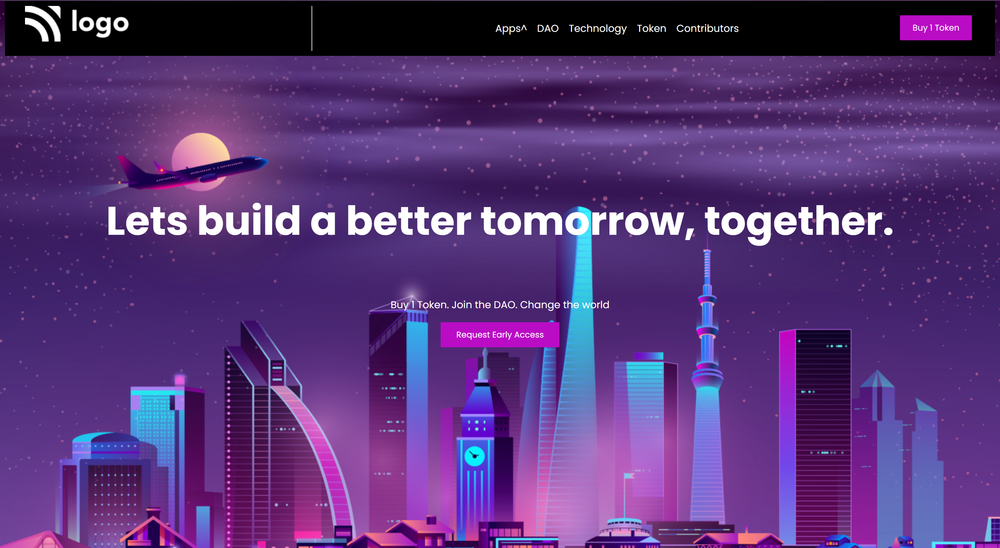

# This project Built With
#### 1.HTML
#### 2.CSS

## Acknowledgements
This landing page, took me almost 5 hrs to complete,this is my project five in fullstack development course by ineuron.in.

### During this project I've learned:

1.How to use border left property for line in nav bar section.
2.How layout webpage.
3.How to select the psuedo selector for after effect.
4.How to postion element using CSS position properties.

## Here is screen shot of project1.

## Here is live link
[Live link]()